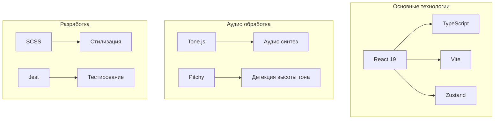
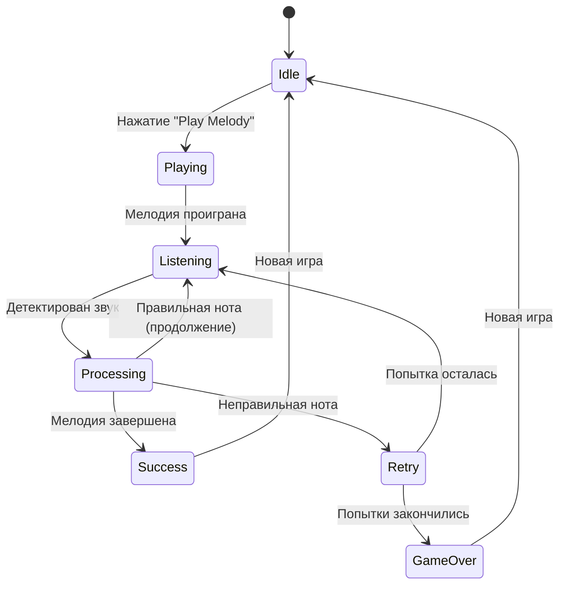
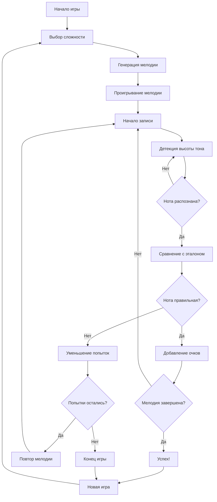
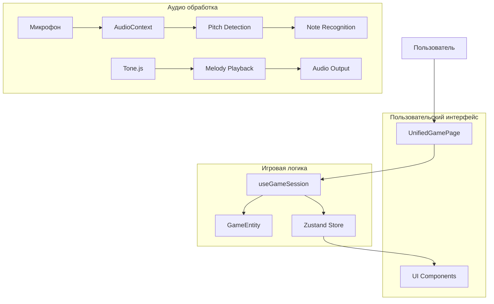
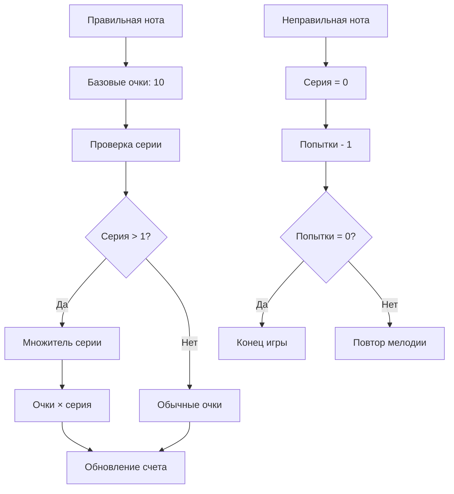
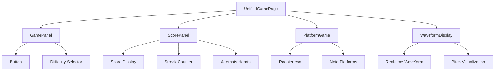

# 🎵 Ear Warrior - Документация проекта

## 📋 Обзор проекта

**Ear Warrior** - это интерактивная веб-игра для тренировки музыкального слуха, которая помогает пользователям развивать навыки распознавания высоты тона и мелодической памяти через игровую механику в реальном времени.

## 🎯 Основные функции

- **Генерация мелодий** - Создание мелодий различной сложности (1-8 нот)
- **Детекция высоты тона** - Анализ пения пользователя через микрофон
- **Система очков** - Награды за правильные ответы и серии
- **Прогрессивная сложность** - 4 уровня сложности от начинающего до продвинутого
- **Визуальная обратная связь** - Анимированный интерфейс с персонажем-петухом

## 🏗️ Архитектура проекта

Проект использует **Feature Slice Design** архитектуру:

```
📁 src/
├── 🎮 entities/          # Базовые сущности
│   ├── game/            # Игровая логика
│   ├── melody/          # Модель мелодии
│   └── note/            # Модель ноты
├── ⚡ features/          # Бизнес-логика
│   ├── game-logic/      # Логика игры
│   ├── melody-generation/  # Генерация мелодий
│   └── pitch-detection/    # Детекция высоты тона
├── 🧩 widgets/          # Составные компоненты
│   ├── game-panel/      # Панель управления
│   ├── platform-game/   # Игровая платформа
│   ├── score-panel/     # Панель счета
│   └── waveform-display/   # Отображение волны
├── 📄 pages/            # Страницы
│   └── UnifiedGamePage/  # Главная игровая страница
├── 🔄 processes/        # Бизнес-процессы
│   └── game-session/    # Управление игровой сессией
└── 🔧 shared/           # Общие компоненты
    ├── api/             # API
    ├── config/          # Конфигурация
    ├── lib/             # Утилиты
    ├── store/           # Хранилище состояния
    ├── types/           # Типы TypeScript
    └── ui/              # UI компоненты
```

## 🔧 Технологический стек



## 🎮 Игровой процесс

### Диаграмма состояний игры



### Алгоритм работы



## 🎵 Система сложности

| Уровень | Количество нот | Интервалы | Особенности |
|---------|---------------|-----------|-------------|
| **Elementary** | 1 | Унисон | Одна нота для начинающих |
| **Easy** | 3 | Простые (2-4 полутона) | Основные интервалы |
| **Medium** | 5 | Средние (5-7 полутонов) | Сложные интервалы |
| **Hard** | 8 | Все (0-12 полутонов) | Полный диапазон |

## 🎼 Музыкальные интервалы

```mermaid
graph LR
    A[Unison - 0] --> B[Minor 2nd - 1]
    B --> C[Major 2nd - 2]
    C --> D[Minor 3rd - 3]
    D --> E[Major 3rd - 4]
    E --> F[Perfect 4th - 5]
    F --> G[Perfect 5th - 7]
    G --> H[Minor 6th - 8]
    H --> I[Major 6th - 9]
    I --> J[Minor 7th - 10]
    J --> K[Major 7th - 11]
    K --> L[Octave - 12]
```



## 🔄 Поток данных



## 📊 Система очков



## 🧪 Тестирование

Проект включает unit-тесты для основных компонентов:

- **Entities**: Тесты игровых сущностей
- **Features**: Тесты бизнес-логики
- **Shared**: Тесты утилит и библиотек

```bash
# Запуск тестов
npm run test

# Запуск тестов с наблюдением
npm run test:watch
```

## 🎨 UI компоненты

### Основные виджеты



## 🚀 Запуск проекта

```bash
# Установка зависимостей
npm install

# Запуск в режиме разработки
npm run dev

# Сборка для продакшена
npm run build

# Предварительный просмотр сборки
npm run preview

# Деплой на GitHub Pages
npm run deploy
```

## 📱 Адаптивность

Проект поддерживает различные размеры экранов:

- **Desktop**: Полноэкранный режим игры
- **Tablet**: Адаптированный интерфейс
- **Mobile**: Мобильная версия (в разработке)

## 🔧 Конфигурация

### Аудио настройки

```typescript
export const AUDIO_CONFIG = {
  SAMPLE_RATE: 44100,        // Частота дискретизации
  BUFFER_SIZE: 2048,         // Размер буфера
  MIN_FREQUENCY: 80,         // Минимальная частота
  MAX_FREQUENCY: 1000,       // Максимальная частота
  MIN_CORRELATION: 0.7,      // Минимальная корреляция
  MIN_RMS: 0.01,            // Минимальный RMS
  NOTE_DURATION: '0.5n',     // Длительность ноты
  NOTE_INTERVAL: 0.6,        // Интервал между нотами
  RECORDING_DURATION: 1000,  // Длительность записи (мс)
}
```

### Игровые настройки

```typescript
export const GAME_CONFIG = {
  SUCCESS_SCORE_MULTIPLIER: 10,  // Множитель очков за успех
  FEEDBACK_DURATION: 2000,       // Длительность обратной связи
  SUCCESS_DELAY: 1000,           // Задержка после успеха
  ERROR_FEEDBACK_DURATION: 1500, // Длительность ошибки
}
```

## 🎯 Планы развития

### Фаза 1: Основные улучшения
- [ ] Улучшение точности детекции звука
- [ ] Добавление новых уровней сложности
- [ ] Система учетных записей
- [ ] Мобильное приложение

### Фаза 2: Расширенные функции
- [ ] Тренировка интервалов
- [ ] Распознавание аккордов
- [ ] Социальные функции
- [ ] Система достижений

### Фаза 3: Образовательная платформа
- [ ] Интеграция музыкальной теории
- [ ] Система видеоуроков
- [ ] Панель для преподавателей
- [ ] Расширенная аналитика

## 🤝 Вклад в проект

1. Форкните репозиторий
2. Создайте ветку для функции (`git checkout -b feature/AmazingFeature`)
3. Зафиксируйте изменения (`git commit -m 'Add some AmazingFeature'`)
4. Отправьте в ветку (`git push origin feature/AmazingFeature`)
5. Откройте Pull Request

## 📄 Лицензия

Этот проект лицензирован под MIT License - см. файл [LICENSE](LICENSE) для деталей.

## 🎵 Авторы

- **Основная разработка**: Команда Ear Warrior
- **Музыкальная консультация**: Профессиональные музыканты
- **UX/UI дизайн**: Команда дизайна

---

*Документация обновлена: декабрь 2024*