# Ear Warrior - Obsidian Graphics Documentation

## Project Overview

**Ear Warrior** is an interactive web-based musical ear training game built with React + TypeScript using Feature Slice Design architecture. The application helps users develop pitch recognition and melodic memory skills through real-time audio feedback.

## 1. Architecture Overview

### Feature Slice Design Structure

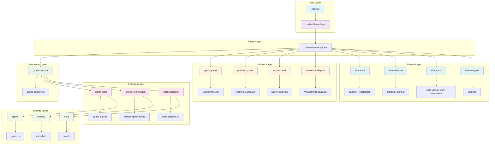

## 2. Application Flow

### Main Game Flow

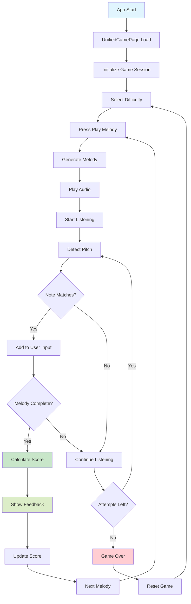

## 3. Component Hierarchy

### UI Components Structure

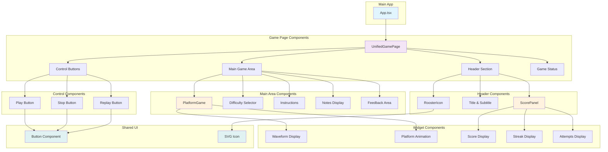

## 4. Data Flow

### State Management & Data Flow

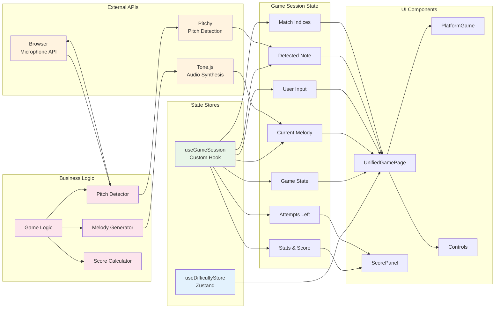

## 5. Technical Stack

### Technology Architecture

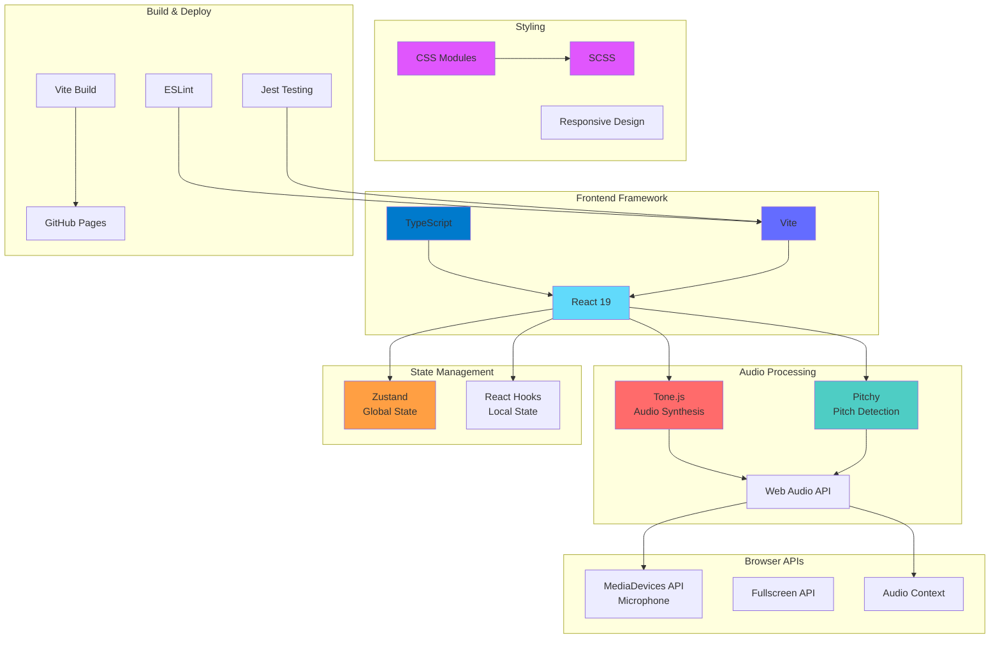

## 6. Game Mechanics

### Scoring System

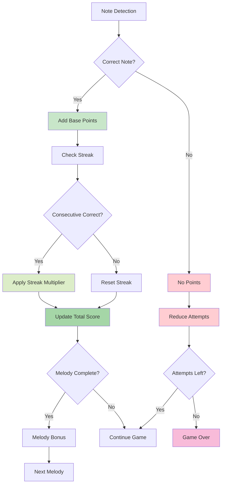

### Difficulty Progression

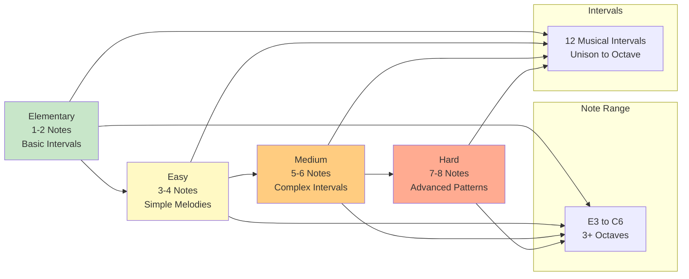

## 7. User Journey

### Complete User Experience Flow

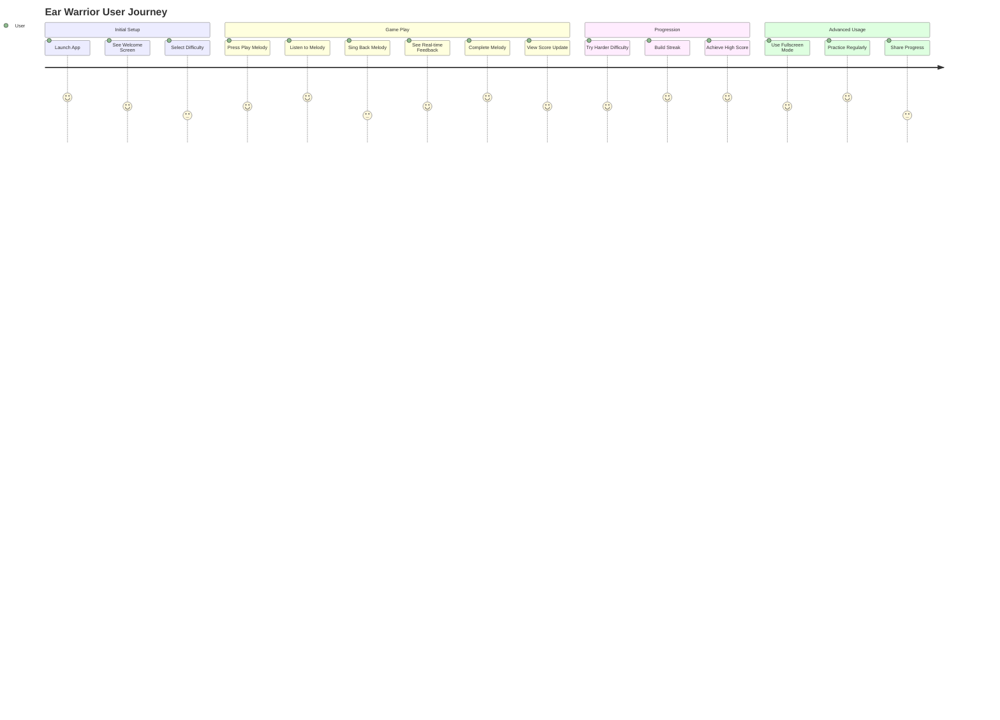

## 8. Development Roadmap

### Feature Development Timeline

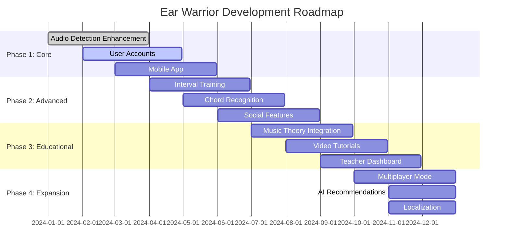

## 9. Performance Metrics

### Key Performance Indicators

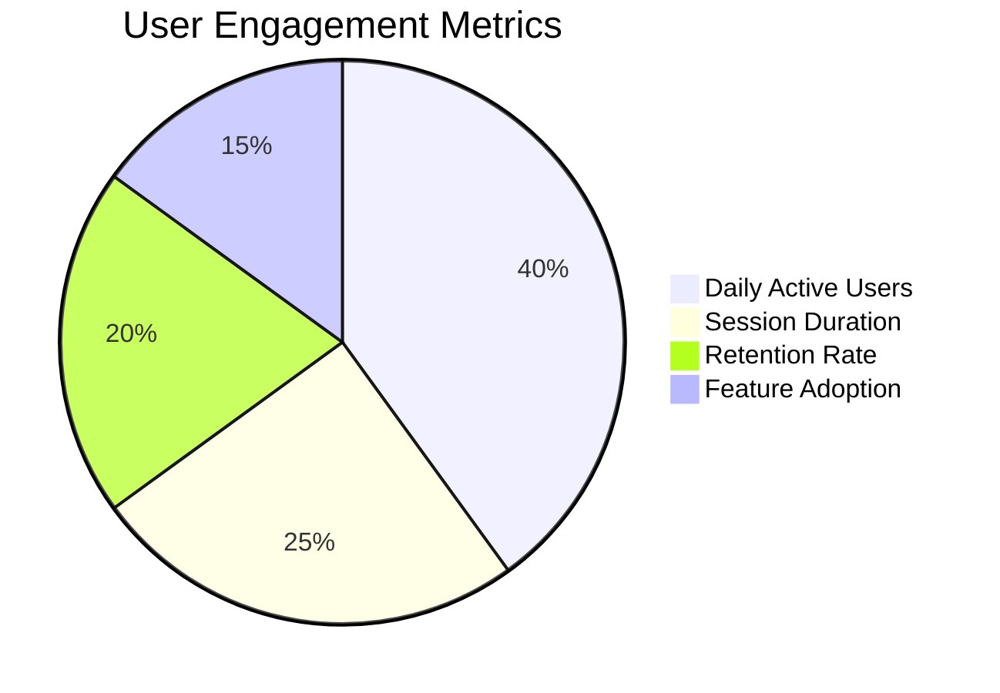

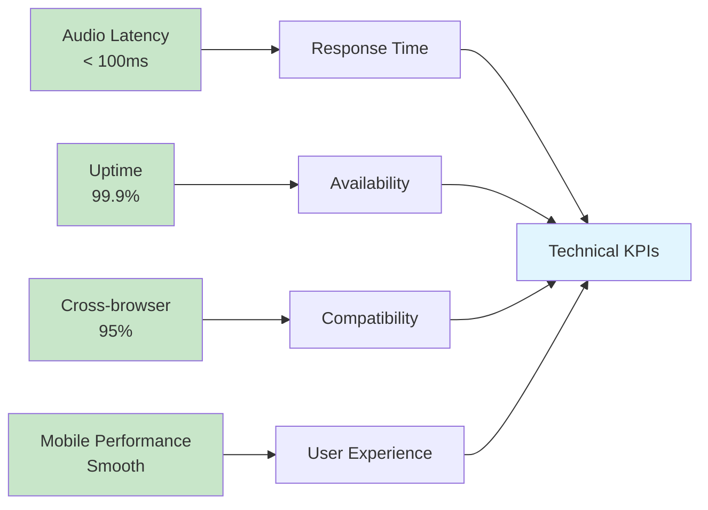

## 10. Entity Relationships

### Core Business Entities

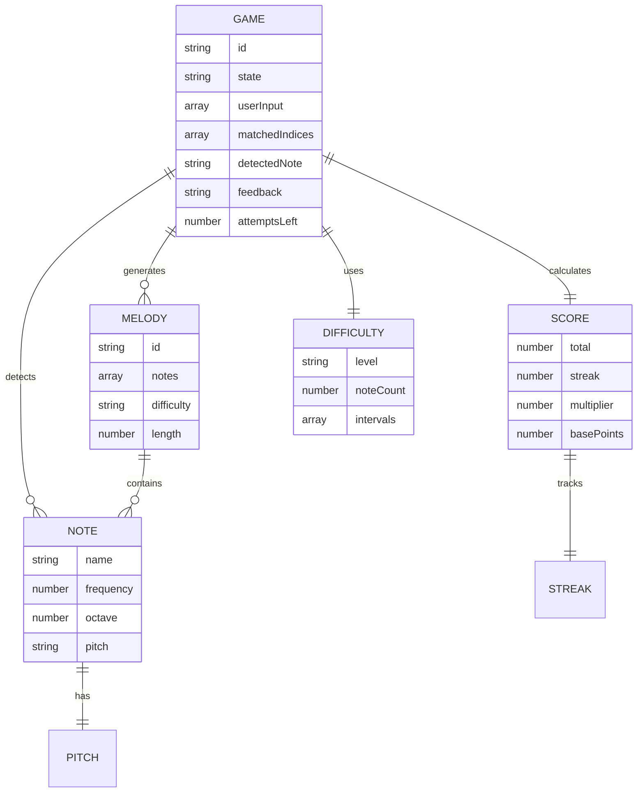

---

## Usage in Obsidian

To use these graphics in Obsidian:

1. **Install Mermaid Plugin** - Enable Mermaid diagram support
2. **Copy Diagrams** - Copy individual diagram code blocks
3. **Create Notes** - Create separate notes for each diagram type
4. **Link Diagrams** - Use `[[Note Name]]` to link between diagrams
5. **Tag Organization** - Use tags like `#ear-warrior #architecture #flow`

### Suggested Obsidian Structure

```
📁 Ear Warrior/
├── 📄 Overview.md
├── 📄 Architecture.md (Diagram 1)
├── 📄 Application Flow.md (Diagram 2)
├── 📄 Components.md (Diagram 3)
├── 📄 Data Flow.md (Diagram 4)
├── 📄 Technical Stack.md (Diagram 5)
├── 📄 Game Mechanics.md (Diagram 6)
├── 📄 User Journey.md (Diagram 7)
├── 📄 Roadmap.md (Diagram 8)
└── 📄 Performance.md (Diagram 9)
```

### Sample Obsidian Tags

```
#ear-warrior #react #typescript #audio #game #architecture #fsd #mermaid #music #education
```
