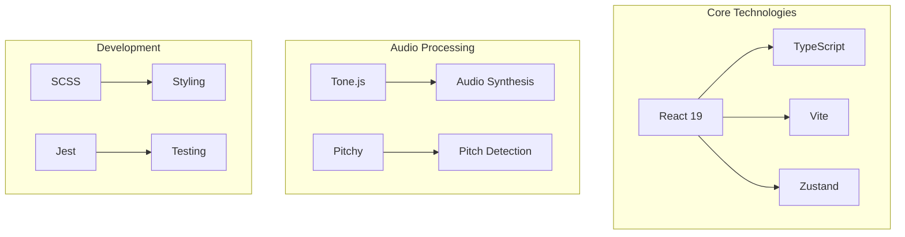
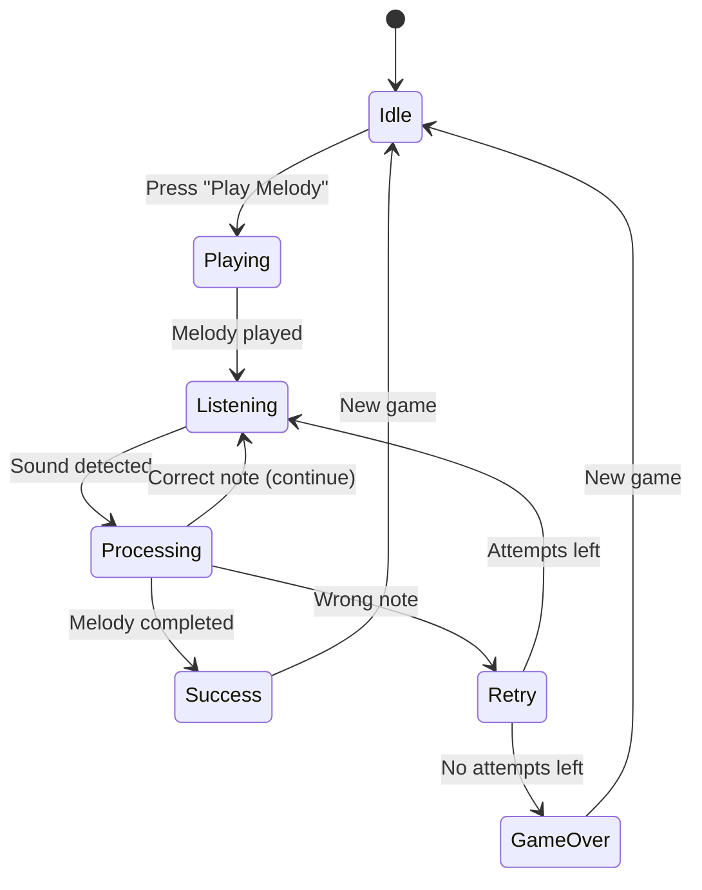
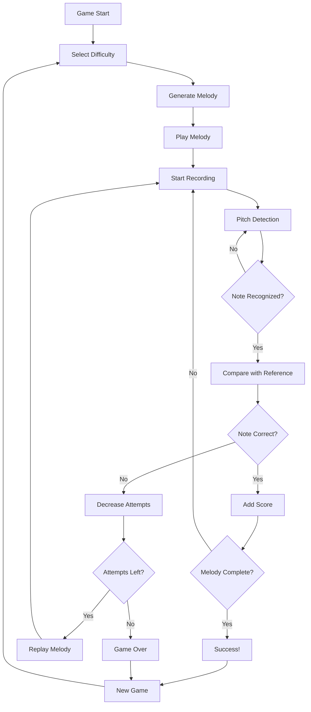
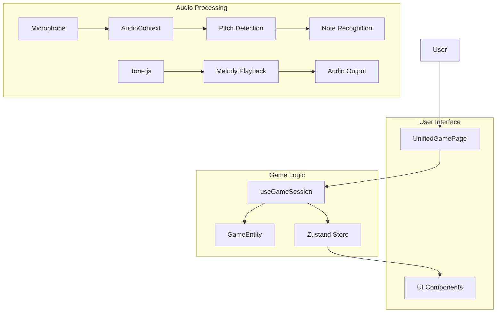
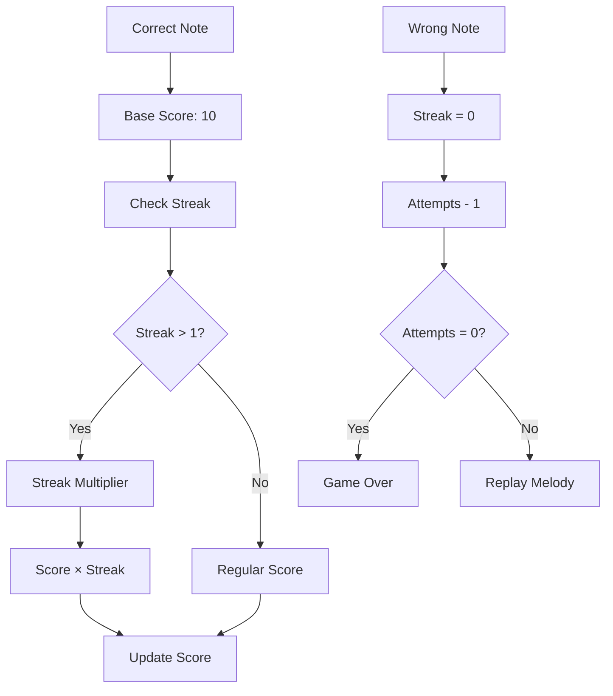
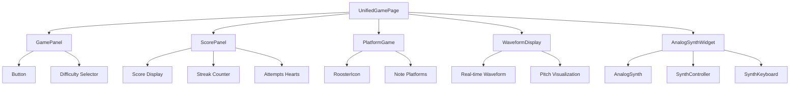

# 🎵 Ear Warrior - Musical Ear Training Game

## 🎹 New Feature: Analog Synthesizer

Experience warm analog sounds while training your musical ear! The built-in analog synthesizer adds a new dimension to your practice sessions.

### Features

- **🎸 Lead Sounds**: Sharp and cutting lead tones perfect for melodies
- **🌊 Pad Sounds**: Warm and atmospheric textures for ambient practice  
- **🔊 Bass Sounds**: Deep and punchy bass tones with character
- **⚡ Arp Sounds**: Quick and percussive sounds for rhythmic training

### Analog Character

- **Drift**: Subtle pitch instability for authentic analog feel
- **Warmth**: High-frequency rolloff for vintage character
- **Saturation**: Harmonic distortion for analog richness
- **Effects**: Built-in chorus, reverb, and ping-pong delay

### How to Use

1. Click the **� Analog Synth** button (purple, top-right corner)
2. Choose from 4 preset sounds: Lead, Pad, Bass, or Arp
3. Play notes using the virtual keyboard
4. Adjust parameters with the analog-style knobs:
   - **Oscillator**: Waveform selection and detuning
   - **Filter**: Cutoff, resonance, and envelope amount
   - **Envelope**: Attack, decay, sustain, release (ADSR)
   - **Effects**: Chorus, reverb, and delay controls
   - **Analog Character**: Drift, warmth, and saturation

### Technical Details

Built with:
- **Tone.js** for audio synthesis and effects
- **React** for the user interface  
- **Zustand** for state management
- **Feature Slice Design** architecture

The synthesizer uses polyphonic synthesis with:
- Multiple oscillator waveforms (sawtooth, square, triangle, sine)
- Analog-style filter with resonance
- Frequency envelope for filter modulation  
- LFO for pitch drift simulation
- Professional effects chain

---

## 🌌 Audio Visualization

Experience immersive real-time audio visualization while training your ear! The sky reacts beautifully to your voice and singing.

### Visual Effects

- **🎨 Dynamic Sky Colors**: Sky gradient changes based on audio frequency - low notes create purple/magenta hues, high notes create blue/green colors
- **✨ Aurora Borealis**: Northern lights effect that dances with your voice intensity
- **⭐ Reactive Stars**: Stars that twinkle, grow, and glow in sync with your audio input
- **🎵 Smooth Transitions**: Effects smoothly fade in and out as you start and stop singing

### How It Works

1. **Start Playing**: Click "Play Melody" to begin a training session
2. **Sing Along**: When recording starts, the sky immediately responds to your voice
3. **Watch the Magic**: Lower frequencies create warmer colors, higher frequencies create cooler colors
4. **Aurora Effect**: Sing loudly to trigger the beautiful Aurora Borealis effect in the sky

### Technical Features

- Real-time frequency analysis (80-1000 Hz musical range)
- 60fps smooth animations synchronized with audio
- HSL color space for natural color transitions
- Canvas-based rendering for optimal performance

---

## 📋 Project Overview

**Ear Warrior** is an interactive web-based musical ear training game that helps users develop pitch recognition and melodic memory skills through real-time audio feedback and gamified learning experiences.

## 🎯 Core Features

- **Melody Generation** - Creates melodies of varying complexity (1-8 notes)
- **Pitch Detection** - Analyzes user's singing through microphone
- **Scoring System** - Rewards for correct answers and streaks
- **Progressive Difficulty** - 4 difficulty levels from beginner to advanced
- **Visual Feedback** - Animated interface with rooster character
- **🌌 Audio Visualization** - Real-time sky visualization that reacts to your voice
- **Analog Synthesizer** - Built-in analog synthesizer with multiple presets

## 🏗️ Project Architecture

The project uses **Feature Slice Design** architecture:

```
📁 src/
├── 🎮 entities/          # Base entities
│   ├── game/            # Game logic
│   ├── melody/          # Melody model
│   └── note/            # Note model
├── ⚡ features/          # Business logic
│   ├── analog-synth/    # Analog synthesizer
│   ├── game-logic/      # Game logic
│   ├── melody-generation/  # Melody generation
│   └── pitch-detection/    # Pitch detection
├── 🧩 widgets/          # Composite components
│   ├── analog-synth-widget/ # Synthesizer widget
│   ├── game-panel/      # Control panel
│   ├── platform-game/   # Game platform
│   ├── score-panel/     # Score panel
│   └── waveform-display/   # Wave display
├── 📄 pages/            # Pages
│   └── UnifiedGamePage/  # Main game page
├── 🔄 processes/        # Business processes
│   └── game-session/    # Game session management
└── 🔧 shared/           # Shared components
    ├── api/             # API
    ├── config/          # Configuration
    ├── lib/             # Utilities
    ├── store/           # State storage
    ├── types/           # TypeScript types
    └── ui/              # UI components
```

## 🔧 Technology Stack



## 🎮 Gameplay

### Game State Diagram



### Workflow Algorithm



## 🎵 Difficulty System

| Level | Note Count | Intervals | Features |
|-------|-----------|-----------|----------|
| **Elementary** | 1 | Unison | Single note for beginners |
| **Easy** | 3 | Simple (2-4 semitones) | Basic intervals |
| **Medium** | 5 | Moderate (5-7 semitones) | Complex intervals |
| **Hard** | 8 | All (0-12 semitones) | Full range |

## 🎼 Musical Intervals

```mermaid
graph LR
    A[Unison - 0] --> B[Minor 2nd - 1]
    B --> C[Major 2nd - 2]
    C --> D[Minor 3rd - 3]
    D --> E[Major 3rd - 4]
    E --> F[Perfect 4th - 5]
    F --> G[Perfect 5th - 7]
    G --> H[Minor 6th - 8]
    H --> I[Major 6th - 9]
    I --> J[Minor 7th - 10]
    J --> K[Major 7th - 11]
    K --> L[Octave - 12]
```



## 🔄 Data Flow



## 📊 Scoring System



## 🧪 Testing

The project includes unit tests for core components:

- **Entities**: Tests for game entities
- **Features**: Tests for business logic
- **Shared**: Tests for utilities and libraries

```bash
# Run tests
npm run test

# Run tests with watch mode
npm run test:watch
```

## 🎨 UI Components

### Main Widgets



## 🚀 Getting Started

```bash
# Install dependencies
npm install

# Run in development mode
npm run dev

# Build for production
npm run build

# Preview build
npm run preview

# Deploy to GitHub Pages
npm run deploy
```

## 📱 Responsiveness

The project supports various screen sizes:

- **Desktop**: Full-screen game mode with analog synthesizer
- **Tablet**: Adapted interface
- **Mobile**: Mobile version with responsive synthesizer interface

## 🔧 Configuration

### Audio Settings

```typescript
export const AUDIO_CONFIG = {
  SAMPLE_RATE: 44100,        // Sample rate
  BUFFER_SIZE: 2048,         // Buffer size
  MIN_FREQUENCY: 80,         // Minimum frequency
  MAX_FREQUENCY: 1000,       // Maximum frequency
  MIN_CORRELATION: 0.7,      // Minimum correlation
  MIN_RMS: 0.01,            // Minimum RMS
  NOTE_DURATION: '0.5n',     // Note duration
  NOTE_INTERVAL: 0.6,        // Interval between notes
  RECORDING_DURATION: 1000,  // Recording duration (ms)
}
```

### Game Settings

```typescript
export const GAME_CONFIG = {
  SUCCESS_SCORE_MULTIPLIER: 10,  // Score multiplier for success
  FEEDBACK_DURATION: 2000,       // Feedback duration
  SUCCESS_DELAY: 1000,           // Delay after success
  ERROR_FEEDBACK_DURATION: 1500, // Error feedback duration
}
```

## 🎯 Development Roadmap

### Phase 1: Core Improvements
- [ ] Improve audio detection accuracy
- [ ] Add new difficulty levels
- [ ] User accounts system
- [ ] Mobile application

### Phase 2: Advanced Features
- [ ] Interval training
- [ ] Chord recognition
- [ ] Social features
- [ ] Achievement system
- [x] Analog synthesizer integration

### Phase 3: Educational Platform
- [ ] Music theory integration
- [ ] Video tutorial system
- [ ] Teacher dashboard
- [ ] Advanced analytics

## 🤝 Contributing

1. Fork the repository
2. Create a feature branch (`git checkout -b feature/AmazingFeature`)
3. Commit your changes (`git commit -m 'Add some AmazingFeature'`)
4. Push to the branch (`git push origin feature/AmazingFeature`)
5. Open a Pull Request

## 📄 License

This project is licensed under the MIT License - see the [LICENSE](LICENSE) file for details.

## 🎵 Authors

- **Core Development**: Ear Warrior Team
- **Music Consultation**: Professional Musicians
- **UX/UI Design**: Design Team

---

*Documentation updated: December 2024*
